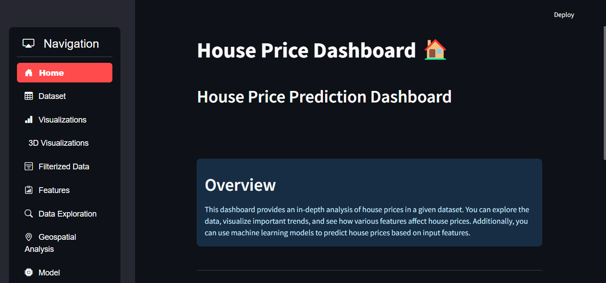
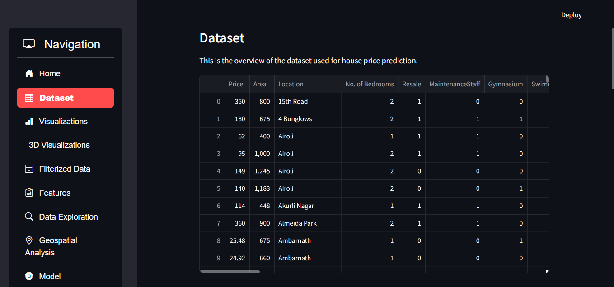
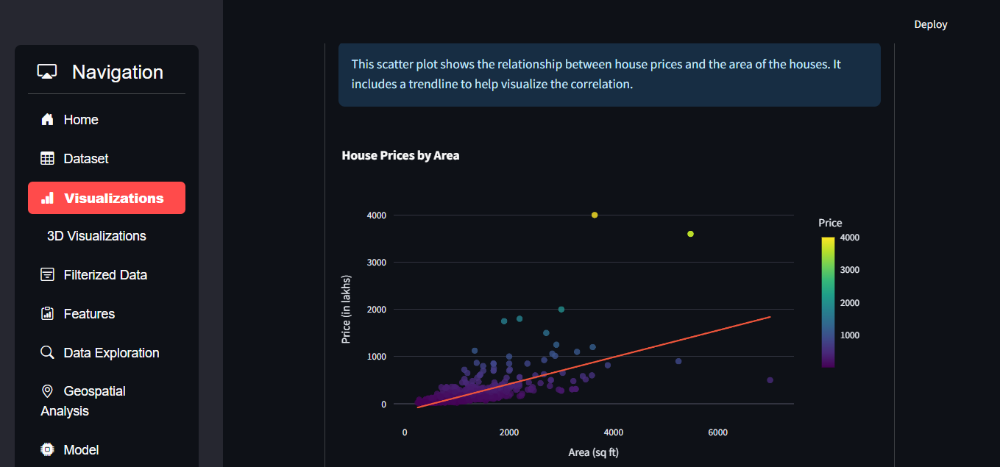
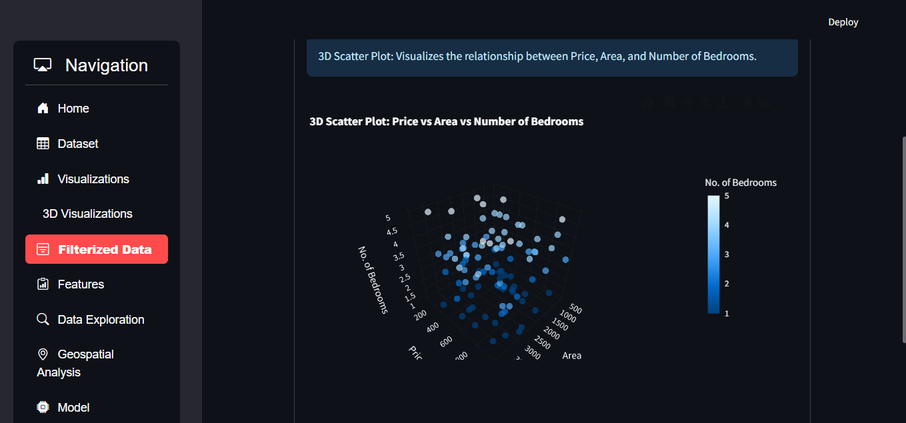
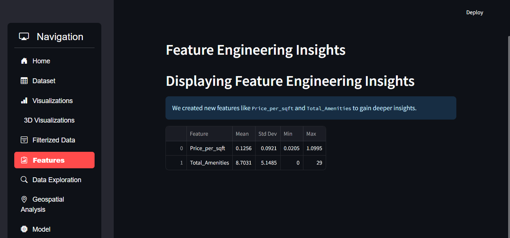
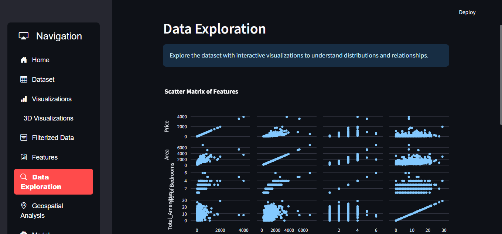
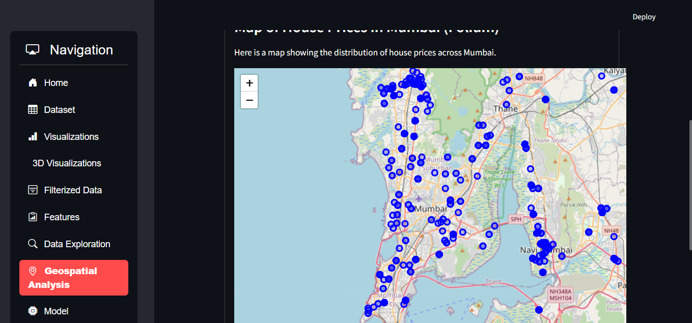
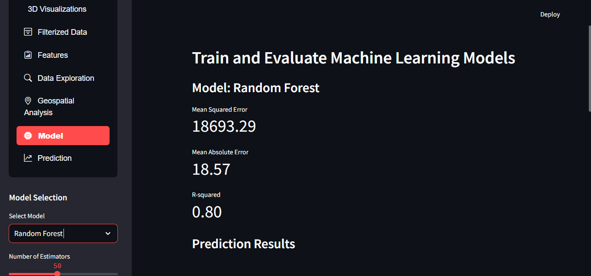
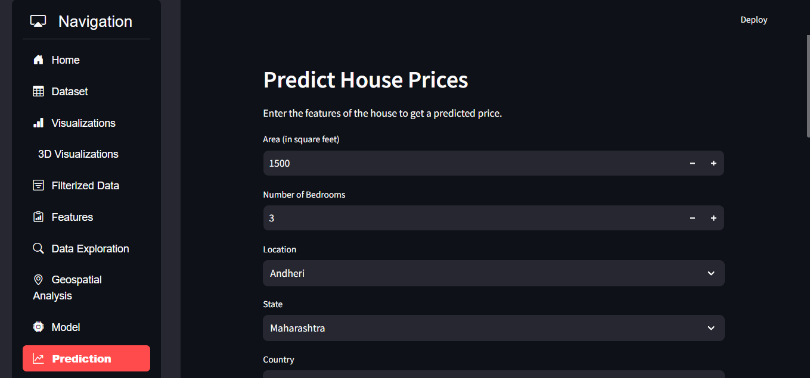

# House Price Prediction Dashboard

## Description

A data-driven web application built using Streamlit and Python libraries to predict house prices based on various features and trends. This interactive dashboard allows users to explore data, visualize insights, and predict future house prices using machine learning models.

## Sitemap of the Data-Driven Web App

- **Home**: Overview of the dashboard.
- **Data**: Explore the dataset and its features.
- **Visualizations**: Visualize important trends and insights.
- **Features**: Feature engineering insights.
- **Data Exploration**: Understand distributions and relationships.
- **Geospatial Analysis**: Analyze house prices based on geographical data.
- **Model**: Train and evaluate machine learning models for house price prediction.
- **Prediction**: Predict future house prices based on input parameters.

## Installation

1. Clone the repository:

   ```bash
   git clone https://github.com/yourusername/house-price-prediction-dashboard.git

2. Navigate to the project directory:

   ```bash
   cd house-price-prediction-dashboard

3. Install the required libraries:
   
   ```bash
   pip install -r requirements.txt


Requirements:
- Python 3.x
- Streamlit
- Pandas
- Numpy
- Scikit-learn
- Plotly
- Folium
- Joblib


Usage:
1. Run the application using the following command:
 
  ```bash
  streamlit run app.py
2. Navigate through the different sections using the side navigation bar to explore data, visualize insights, and make predictions.


Features Enhancements:
- Interactive Data Visualizations: Utilize Plotly and Folium for insightful visualizations.
- Dynamic Feature Engineering: Analyze key features contributing to house price predictions.
- Model Evaluation: Compare multiple machine learning models to find the most accurate predictor.
- Geospatial Analysis: Understand price variations based on location


License
- This project is licensed under the MIT License - see the LICENSE file for details.


Acknowledgement:
- Built using Streamlit
- Thanks to the Streamlit Community for inspiration and resources.


Media:
Screenshots












